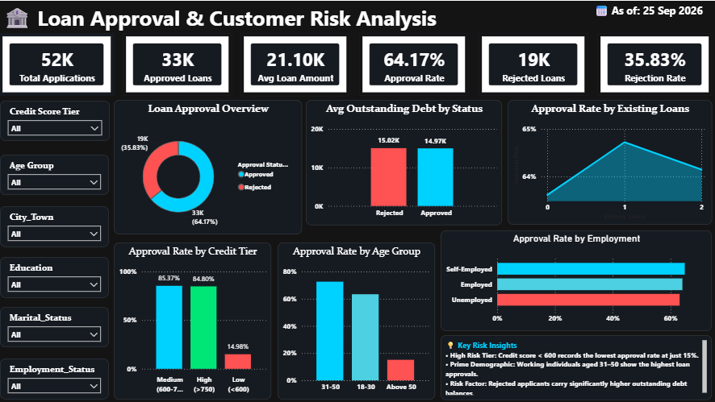

# 🏦 Loan Approval & Customer Risk Analysis
> **An End-to-End Financial Data Analysis & Risk Assessment Project**


---

## 📌 1. Project Metadata
* **Author:** Dhinakarraj S
* **Role:** Data Analyst
* **Domain:** Banking & Financial Services / Credit Risk Analytics
* **Tools & Technologies:** Python (Pandas), MySQL, Microsoft Power BI (DAX), WPS Office
* **Dataset Scale:** 52,000 Historical Loan Applications

---

## 🎯 2. Project Objective & Business Problem
Financial lending institutions face the continuous challenge of expanding their loan portfolio while strictly managing credit risk and defaults. Manual underwriting often leads to operational bottlenecks, while rigid rule-based systems risk turning away creditworthy customers or approving hidden risks.

### Core Business Questions Addressed:
* **Risk Identification:** Which applicant parameters (Credit Score, Age, Income, Employment Status) act as true predictors for approval or rejection?
* **Portfolio Metrics:** What is the overall portfolio performance in terms of volume, approval rate, and average ticket size?
* **Demographic Patterns:** How do age brackets and credit tiers correlate with approval behavior?
* **Operational Parity:** Do factors like employment classification, existing loans, or outstanding debt significantly separate approvals from rejections?

---
[ Raw CSV (52K) ]
│
▼ (Python / Pandas)
[ Data Ingestion, Hygiene & Schema Auditing ]
│
▼ (SQLAlchemy / PyMySQL)
[ Relational Ingestion into MySQL Database ]
│
▼ (MySQL Query Engine)
[ 12 Business-Driven SQL Analytics (CTEs, Window Ranking, Aggregations) ]
│
▼ (Power BI & DAX)
[ Interactive Risk Intelligence Dashboard ]
│
▼ (Executive Strategy)
[ Data-Driven Recommendations & Underwriting Insights ]
---

## 📊 4. Interactive Power BI Dashboard


### Dashboard KPI Summary:
* **Total Applications:** 52,000
* **Approved Loans:** 33,366 (64.17%)
* **Rejected Loans:** 18,634 (35.83%)
* **Average Loan Requested:** ₹21,102.70
* **Interactive Slicers:** Credit Score Tier, Age Group, City/Town, Education Level, Marital Status, Employment Status.

---

## 🔍 5. Key SQL & Analytical Insights

| Analysis Area | Key Metrics / Segmentation | Primary Finding |
| :--- | :--- | :--- |
| **Credit Score** | • Low (<600): **14.98% Approved** (85.02% Rejected)<br>• Medium (600–750): **85.37% Approved**<br>• High (>750): **84.80% Approved** | **Strongest Approval Gate:** Crossing the 600 mark increases approval rates by over **70%**. |
| **Age Demographic** | • 18–30 Years: **63.35% Approved**<br>• 31–50 Years: **72.58% Approved**<br>• Above 50 Years: **15.14% Approved** (84.86% Rejected) | Applicants over 50 face severe rejection rates due to conventional age thresholds. |
| **High-Approval Core Segment** | • **Criteria:** Credit Score $\ge$ 600 AND Age $\le$ 50<br>• **Volume:** 36,532 applications (**70.25% Portfolio Share**)<br>• **Approval Rate:** **84.99%** | The ideal target segment for automated, streamlined underwriting. |
| **Employment Parity** | • Self-Employed: **64.93%**<br>• Employed: **64.11%**<br>• Unemployed: **63.15%** | Employment category alone provides negligible predictive separation. |
| **Debt Exposure** | • Avg Debt (Approved): **₹14,965.69**<br>• Avg Debt (Rejected): **₹15,019.20** | Outstanding debt levels are practically identical across approval and rejection groups. |

---

## 💡 6. Strategic Business Recommendations
1. **Automated Fast-Track Workflows:** Formally deploy automated straight-through processing (STP) for the core low-risk segment (Credit Score $\ge$ 600 & Age $\le$ 50), which forms **70.25% of all applications**, drastically reducing acquisition costs.
2. **Alternative Underwriting for Low Credit (<600):** Instead of an 85% blanket rejection, evaluate cash flows, recurring utility payments, and collateral-backed credit options.
3. **Pensions & Wealth Evaluation for Mature Borrowers (>50):** Revise strict age-based rejections (84.86% rejection) by integrating post-retirement cash flows, assets, and fixed deposit holdings.
4. **Shift from Employment Titles to Repayment Capacity:** Focus on debt-to-income (DTI) and net disposable income rather than categorical labels (Employed vs Self-Employed).

---

## 📂 7. Repository Structure & Deliverables
├── cleaned_loan_approval.csv          # Cleaned & validated dataset (52K records)
├── Loan Dataset.csv                  # Raw source application data
├── loan_approval_pandas.ipynb        # Data audit, cleaning & MySQL ingestion pipeline
├── loan_approval_sql_analysis.ipynb  # 12 Business SQL queries & CTE/window implementations
├── loan_approval.pbix                # Interactive Power BI report with DAX measures
├── loan_approval_dashboard.png       # Executive dashboard visual export
└── Loan_Approval_docs.pdf            # 10-page master technical documentation
---

## 🛠️ How to Replicate This Analysis
1. **Clone the Repository:**
   ```bash
   git clone [https://github.com/Dhinakarraj2006/Loan-Approval-Customer-Risk-Analysis.git](https://github.com/Dhinakarraj2006/Loan-Approval-Customer-Risk-Analysis.git)
   ​Execute Python Pipeline: Run loan_approval_pandas.ipynb to clean data and create the relational table in your local MySQL instance.
​Run SQL Scripts: Execute loan_approval_sql_analysis.ipynb to review business query results.
​Open Dashboard: Launch loan_approval.pbix in Microsoft Power BI Desktop to interact with the visualizations.
## ⚙️ 3. Analytical Pipeline & Architecture
The project follows an end-to-end data analytics lifecycle:
